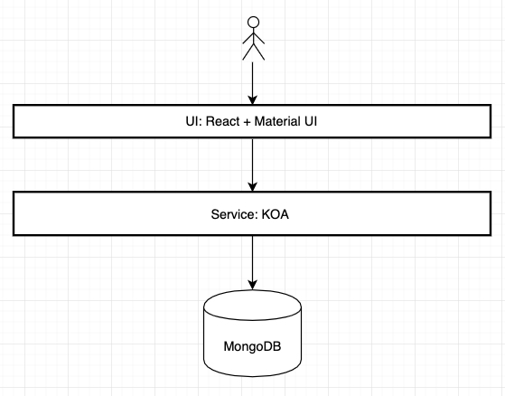
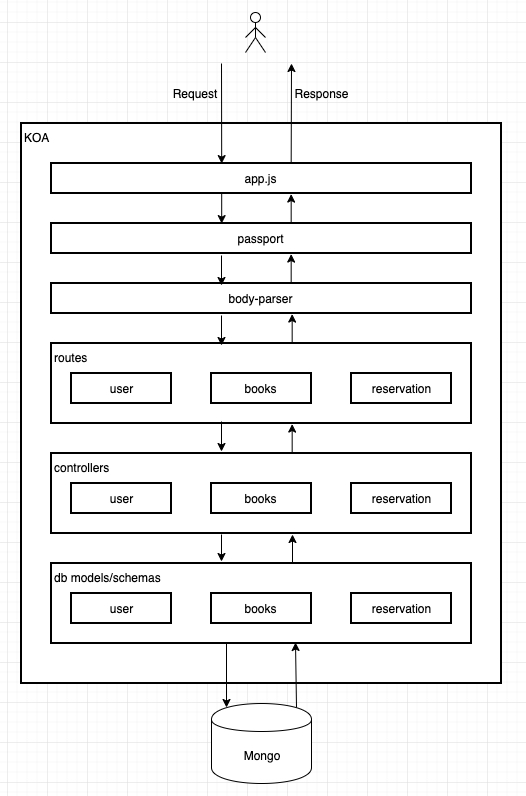

# MiniLibrary
- This is a Books, Users and Reservations mini project. 
- Previous URL refer to http://148.70.236.60.
- You could import postman script to test service endpoints.  

## **Technical Stacks**

### UI
- ReactJS
    - react-router
    - create-react-app
    - axios

- Materail UI
    - momentjs

### Service
- KOA 2.0  
    - koa-generator (default is 2.0 version with higher NodeJS version)
    - koa-passport
    - passport-jwt
    - jsonwebtoken
    - bcrypt
    - mongoose

### DB
- MongoDB (NoSQL)

## **Design Diagram**
### Whole block diagram

### Serice block diagram

## **Work log**
* 2019/4/27  (weekend)
1. Study how to operate MongoDB. Understand collections, documents, .etc.
2. Study KOA 2.0 and try koa-generator. And try to do by following a getting start guide.
3. Init Github repo, VS code debug launch.json.
4. Setup MongoDB on local and Tecent Cloud. 
5. Implement connect MongoDB in KOA project.

* 2019/4/28 (weekend)
1. Study React concept. 
2. Try to create-react-app to create ui project.
3. Try enable eslint, https, how to set proxy to access service endpoint.
4. Try to use mongoose to operate MongoDB in service.

* 201/4/29 (working day)
1. Use mongoose to implement user operation code.

* 2019/4/30 (working day)
1. Use mongoose to implement books, reservation operation code.

* 2019/5/1 (holiday)
1. Study passportJs. 
2. Try to use passportJs and passport-local, passport-jwt. There are many problems encoutered, e.g. authenticate() function can't access. For a long time to find solutions, and then know for KOA 2.0 should introduce koa-passport, not passport. 

* 2019/5/2 (working day)
1. Try to use passport-jwt, koa-jwt. 
2. Try to use jsonwebtoken library. 
3. Try to implement jwt verification logic by self-implement.

* 2019/5/3 (working day)
1. Implement last restful apis, and use postman to test manually. 

* 2019/5/4 (weekend)
1. Study Recat, understand which is state, props, component, .etc.
2. Try to follow a getting started to build simply a React Ui.
3. Study what's Material UI. 

* 2019/5/5 (weekend)
1. Study and introduce axios.
2. Implement SignIn/SignUp UI.
3. Study react-router and follow the guide to practise in project. 
4. Implement BookList UI.

* 2019/5/6  (working day)
1. Add dialogs in SignIn/SignUp UI.
2. Add MyBorrowList UI.
3. Add cancel my reservation function in service.

* 2019/5/7 (working day)
1. Refine code. 
2. Introduce bcrypt to secret user password.

**Some still need to be refine/enhance/modify...**

1. When user logout, need to make the jwtToken lose effectiveness.

